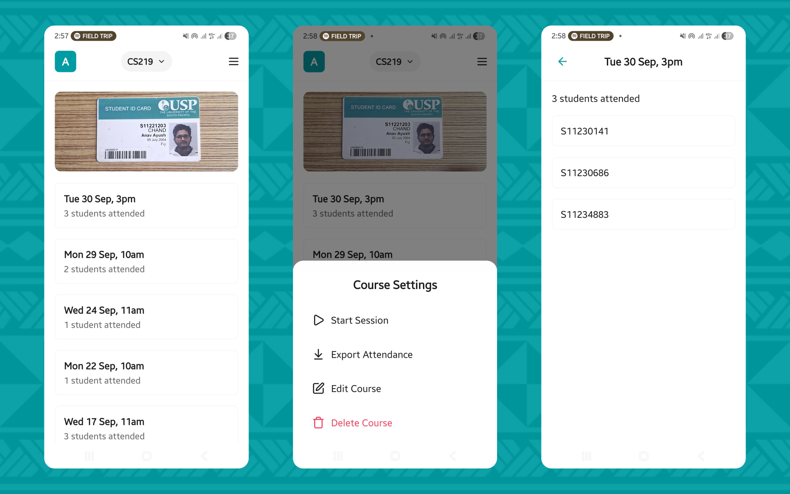

passport\README.md
# PASSport

This is a mobile attendance tracking app built for PASS (Peer Assisted Study Sessions) leaders at the [University of the South Pacific](https://usp.ac.fj). The app lets leaders to quickly and accurately record attendance by scanning student ID cards.



## Overview

PASSport is an offline-first Android application designed to streamline attendance tracking for PASS Leaders. The app eliminates the need for manual paper-based attendance by leveraging barcode scanning technology to quickly and accurately record student participation in study sessions.

## Features

### Core Functionality

- Barcode Scanning: Real-time barcode scanner that reads student ID cards
- Two-Step Verification: Scans both student ID and signature for authenticity
- Automatic Student Registration: New students are automatically added to the system on first scan
- Session-Based Tracking: Create hourly sessions to organize attendance records
- Live Attendance Feed: View real-time list of students who have checked in

### Course Management

- Multiple Courses: Create and manage multiple course codes
- Quick Course Switching: Easily switch between courses via bottom sheet
- Course History: Track attendance history for each course
- Last Accessed Memory: Automatically opens your most recently used course

### Data Export

- Excel Export: Generate .xlsx files with attendance data
- Checksum Protection: Hidden worksheet with SHA256 checksums to prevent tampering
- Date Range Display: Shows the timespan covered in each export
- Easy Sharing: Export directly to email, cloud storage, or other apps

### User Experience

- Dark Mode Support: Automatic theme switching based on system preferences
- Haptic Feedback: Tactile responses for successful scans and actions
- Toast Notifications: Clear feedback messages for all actions
- Empty States: Helpful messages when no data is available
- Smooth Animations: Polished UI with reanimated gestures and transitions

### Security & Validation

- Duplicate Prevention: Blocks duplicate attendance entries for the same session
- Session Time Restrictions: Sessions can only be started in the first 45 minutes of each hour
- Scan Cooldown: 1.5-second cooldown between scans to prevent accidental double-scanning
- Unique Student Records: Student IDs and signatures are validated for uniqueness

## Tech Stack

### Frontend

- React Native - Cross-platform mobile framework
- Expo - Development platform and build toolchain
- Expo Router - File-based navigation
- TypeScript - Type-safe JavaScript

### UI & Interactions

- Lucide React Native - Icon library
- @gorhom/bottom-sheet - Bottom sheet components
- @shopify/flash-list - High-performance lists
- React Native Gesture Handler - Native gesture handling
- React Native Reanimated - Smooth animations
- Expo Haptics - Tactile feedback

### Data & Storage

- Expo SQLite - Local database
- Drizzle ORM - Type-safe ORM
- Context API - Global state management

### Hardware & Permissions

- Expo Camera - Barcode scanning
- Expo File System - File operations
- Expo Sharing - Native share sheet

### Export & Security

- xlsx - Excel file generation
- crypto-js - SHA256 checksums

### Development & Build

- Drizzle Kit - Database migrations
- EAS Build - Cloud build service
- Expo Atlas - Bundle analysis

## Database Schema

The app uses SQLite with Drizzle ORM. The schema includes:

- Users: PASS Leaders who use the app
- Courses: Course codes managed by each leader
- Students: Student records with ID and signature
- Sessions: Hour-based attendance sessions
- Attendance: Junction table linking students to sessions

Run migrations with:

```
npx drizzle-kit generate
npx drizzle-kit migrate
```

## Project Structure

```
passport/
├── app/                    # Expo Router screens
│   ├── course/            # Course-related screens
│   ├── session/           # Session management
│   └── user/              # User settings
├── components/            # Reusable UI components
│   └── sheets/            # Bottom sheet components
├── contexts/              # React Context providers
├── database/              # Database schema and queries
├── utils/                 # Helper functions and types
└── assets/                # Images, fonts, icons
```
